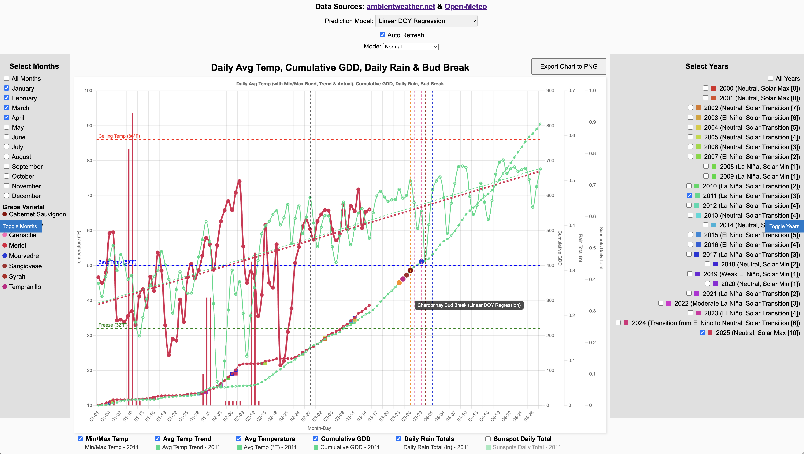

# GDD Prediction and Visualization Dashboard

A comprehensive tool for collecting weather data, calculating Growing Degree Days (GDD), and predicting grapevine bud break using advanced statistical and machine learning models. Built for viticulture, this project integrates real-time and historical weather data from Ambient Weather and Open-Meteo APIs, processes it into a SQLite database, and visualizes it through an interactive web dashboard.

 <!-- Placeholder: Add a screenshot if available -->

## Overview

This project serves vineyard managers and researchers by providing actionable insights into grapevine phenology. It fetches high-resolution weather data (5-minute intervals), calculates cumulative GDD, and employs three distinct models to forecast bud break dates for grape varieties:
- *Linear DOY Regression*: A statistical trend-based prediction using historical bud break DOYs.
- *Median GDD Ensemble*: A hybrid approach blending historical GDD medians with short-term forecasts.
- *Extreme Heat Machine Learning (EHML)*: An XGBoost-based model leveraging multivariate features (GDD, chill hours, DOY, etc.) for dynamic predictions.

The processed data powers an interactive dashboard (`index.html`) hosted locally, displaying temperature, GDD, rainfall, sunspots, pest spray points, and bud break predictions.

## Features

- *Data Ingestion*: Pulls weather data from Ambient Weather (primary and backup stations) and Open-Meteo (historical and forecast), with fallback interpolation for gaps.
- *GDD Calculation*: Computes cumulative GDD incrementally and fully, using a 50°F base temperature, updated daily.
- *Bud Break Prediction*:
  - Linear regression on historical DOY trends.
  - Hybrid model with median GDD targets and 14-day forecasts.
  - Machine learning (XGBoost) with chill hours and historical GDD statistics.
- *Visualization*: Interactive Chart.js dashboard with:
  - Temperature (min/max bands, trends, averages).
  - Cumulative GDD, daily rainfall, and sunspot activity.
  - Pest spray timing and bud break projections with model selection.
  - Zoom/pan functionality and custom legends.
- *Database*: SQLite storage for readings, grapevine GDD thresholds, pest data, and sunspots.
- *Automation*: Auto-refresh and forecast appending for real-time updates.

## Prerequisites

- *Python 3.8+* with dependencies:
  - `requests`, `pandas`, `xgboost`, `numpy`, `sklearn`, `openmeteo-requests`, `requests-cache`, `retry-requests`
- *SQLite*: For data storage (`ambient_weather.sqlite`).
- *DVC*: Optional, for database versioning (`dvc pull` support).
- *Web Browser*: For viewing the dashboard (no server required, runs locally).

## Setup

1. *Clone the Repository*:
   Run: `git clone https://github.com/yourusername/gdd.git` followed by `cd gdd`

2. *Install Dependencies*:
   Run: `pip install -r requirements.txt`
   Create a `requirements.txt` file with the following content:
   requests
   pandas
   xgboost
   numpy
   scikit-learn
   openmeteo-requests
   requests-cache
   retry-requests

3. *Configure the Application*:
   - Edit `config.ini` with your Ambient Weather API keys, MAC addresses, and Open-Meteo coordinates. Example content:
     [global]
     db_filename = ambient_weather.sqlite
     retry_sleep_time = 60
     rate_limit_delay = 60
     api_call_delay = 1.0
     debug = True
     recalc_interval = 300

     [primary]
     mac_address = YOUR_MAC_ADDRESS
     api_key = YOUR_API_KEY
     application_key = YOUR_APP_KEY

     [backup]
     mac_address = YOUR_BACKUP_MAC_ADDRESS

     [api]
     url_template = https://api.ambientweather.net/v1/devices/{mac_address}?apiKey={api_key}&applicationKey={application_key}&endDate={end_date}&limit=288

     [date]
     start_date = 2012-01-01
     bud_break_start = 2025-01-01

     [openmeteo]
     latitude = 38.5
     longitude = -120.5

     [files]
     grapevine_csv = grapevine_gdd.csv
     sunspot_csv = SN_d_tot_V2.0.csv

4. *Pull or Initialize Database*:
   - If using DVC: `dvc pull ambient_weather.sqlite`
   - Otherwise, the script creates a new database if it’s missing.

5. *Run Data Ingestion*:
   Run: `python gdd.py`
   This populates the database with historical data, forecasts, and bud break predictions.

## Usage

1. *Launch the Dashboard*:
   - Open `index.html` in a web browser (e.g., `firefox index.html`).
   - No server needed; it runs client-side with SQLite via `sql.js`.

2. *Interact with the Dashboard*:
   - *Model Selection*: Choose between "Linear DOY Regression," "Median GDD Ensemble," or "Extreme Heat Machine Learning" to view bud break predictions.
   - *Filters*: Toggle months and years via side panels.
   - *Visualization*: Zoom/pan charts, hover for tooltips, and toggle data series in the legend.
   - *Export*: Click "Export Chart to PNG" to save visualizations.

3. *Update Data*:
   - Re-run `gdd.py` periodically to fetch new data and recalculate GDD/predictions.
   - Auto-refresh (every 60s) keeps the dashboard current if running continuously.

## Technical Details

- *Data Pipeline* (`gdd.py`):
  - Fetches 5-minute weather data, interpolates gaps, and appends 14-day forecasts.
  - Calculates GDD incrementally (5-min intervals) and fully for accuracy.
  - Integrates sunspot and pest data from CSV files.
- *Prediction Models*:
  - *Linear DOY Regression*: Fits a trend line to historical bud break DOYs.
  - *Median GDD Ensemble*: Combines median GDD targets with forecast-adjusted rates.
  - *EHML*: Trains XGBoost on features (current GDD, DOY, chill hours, GDD stats) for remaining GDD prediction, dynamically accumulated.
- *Frontend* (`index.html`):
  - Uses Chart.js for plotting, with custom plugins for horizontal/vertical lines.
  - Loads SQLite data via `sql.js` for client-side querying.

## Future Improvements

- Add real-time weather API polling.
- Enhance EHML with more environmental features (e.g., soil moisture).
- Support server-side deployment for multi-user access.
- Improve documentation with model validation metrics.

## Contributing

Contributions are welcome! Fork the repo, submit pull requests, or open issues for bugs/features.

## License

MIT License – see [LICENSE](LICENSE) for details.

---
Built by [Your Name] for viticulture research and management.